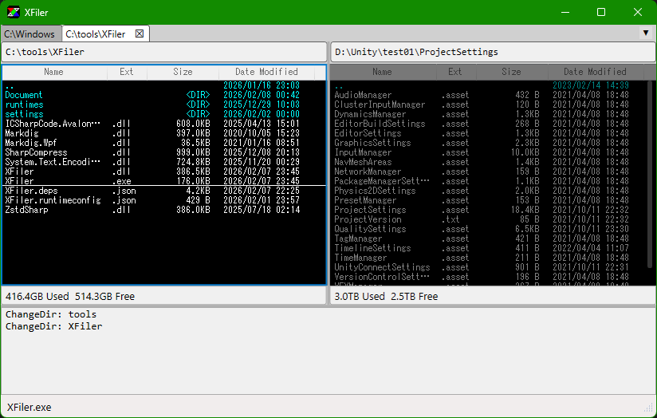

#  XFiler (クロスファイラー)

## 概要

主にキーボードで操作する、いわゆる２画面ファイラーです。

### 主な機能
- **キーボード操作**: マウスを使わずに高速なファイル操作が可能です。
- **2画面ファイラー**: 左右のペインでコピーや移動を直感的に行えます。
- **タブ機能**: 複数のディレクトリやファイルをタブで開いて管理できます。
- **多彩なビューアー**: 
    - テキスト
    - バイナリ (16進ダンプ)
    - 画像 (JPEG, PNG等)
    - **Markdown (簡易表示)**
- **アーカイブ対応**: ZIPファイルの展開・作成、仮想ディレクトリとしての閲覧。
- **カスタマイズ**: キーアサイン、ディレクトリ登録、デザインなどを設定画面から変更可能。

## ダウンロード方法

https://github.com/akiya/XFiler  
GitHubのページの右側にある **Releases** セクションから最新版の `XFiler-(version).zip`をダウンロードしてください。

## 実行方法
1. ダウンロードしたzipファイルをエクスプローラ等で展開し、任意のディレクトリに移動させてください。
2. XFiler.exe を実行してください。
3. 必要な.Netランタイムがインストールされていない場合、指示に従ってランタイムをダウンロード、インストールしてください。
4. Windowsのセキュリティによってブロックされる場合がありますが、その場合は詳細をクリックして実行を許可してください。

## 操作方法
[マニュアル](Manual.md)を参照してください。  

## 更新履歴

### Ver. 1.0.2
- ファイル一覧の列幅をドラッグで変更できるようにしました(保存はされません)
- テキストビュアーの改修
    - 検索時のハイライトの処理を修正しました
    - 別ファイルを表示しても検索文字列を引き継ぐようにしました(Nキーで同じ文字列を検索します)
    - 改行の表示を改行コードごとに変えるようにしました

過去の更新履歴は[こちら](History.md)を参照してください。  

## 制作環境
Google Antigravity  
Visual Studio 2026  
  
ほぼAIで開発されています。  

## 謝辞
gary氏の作られた２画面ファイラー「Records」を大変参考にさせていただいております。  
その他、Windows用の２画面ファイラー、だいなファイラー、KF、NyanFiなども参考にさせていただいております。  
また、X68000用のTF、STF、mint等も大変お世話になりました。  

## 制作者
ミコソフト / あきや  
micosoft / akiya  

https://github.com/akiya  
https://x.com/akiya193  

XFilerサポート用メールアドレス: ``xfiler.68k [at] gmail.com``  
``[at]``をアットマークに置き換えてください。  

## ライセンス
[MIT](LICENSE.txt)  

無保証ですがご自由にお使いください。

## 使用ライブラリ
SharpCompress (MIT) zipファイルの操作に使用  
System.Text.Encoding.CodePages (MIT) 文字コードの扱いに使用  
AvalonEdit (MIT) テキストビュアーに使用  
Markdig.Wpf (MIT) Markdownファイルの表示に使用  
  
Susieプラグインや統合アーカイバプロジェクトのDLLには対応していません。  

